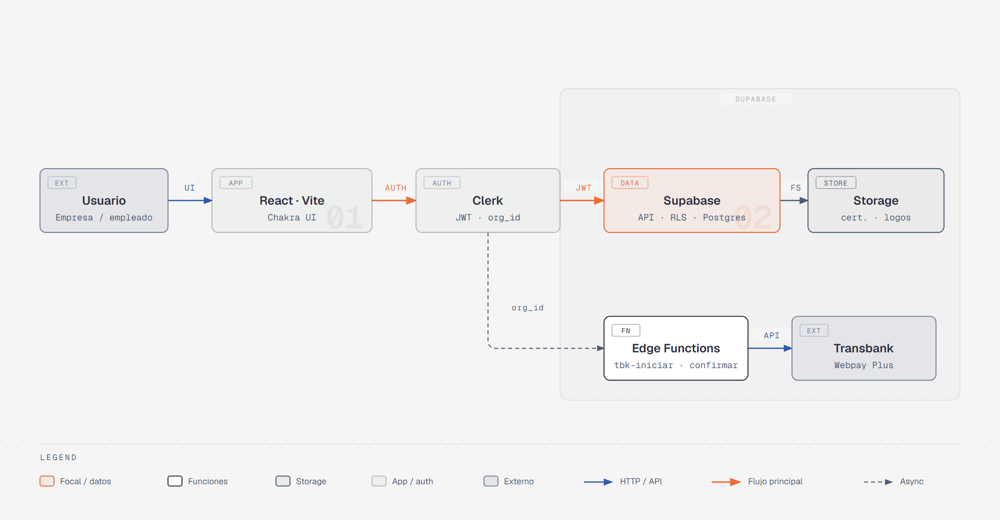
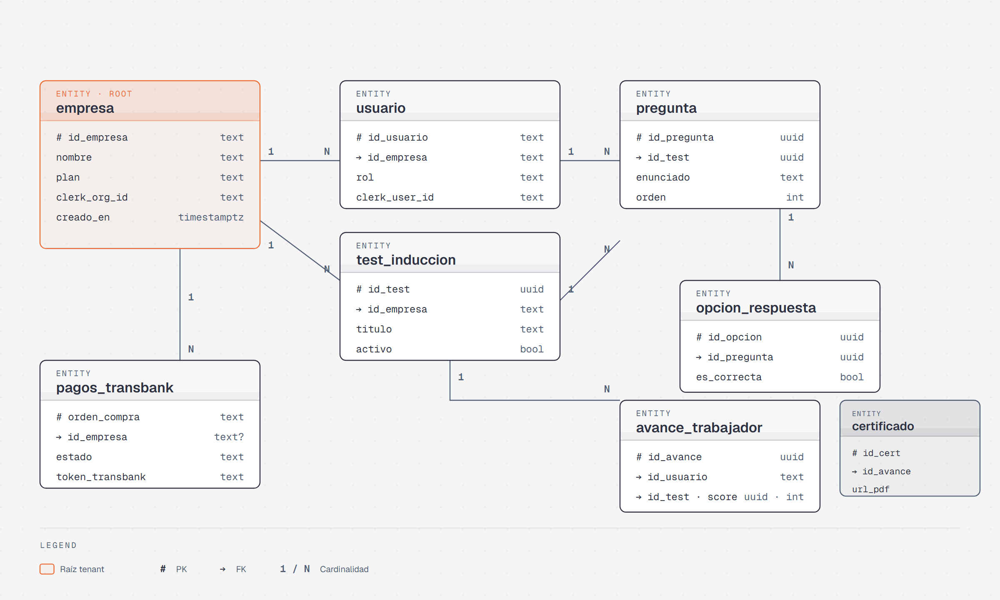
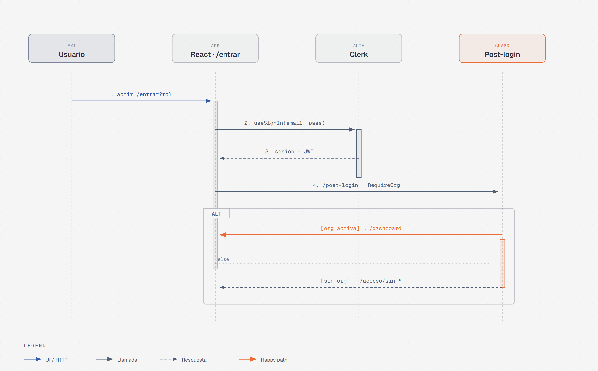
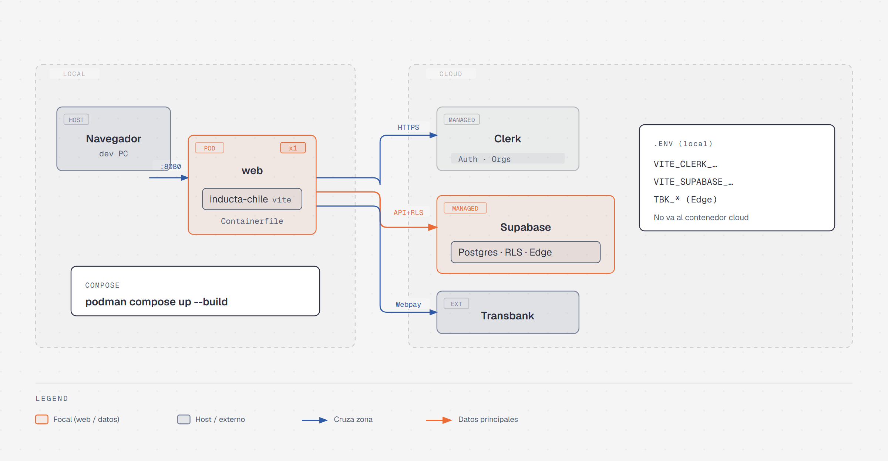

<p align="center">
  
</p>

<h1 align="center">Inducta Chile</h1>

<p align="center">
  <strong>Plataforma SaaS de inducción y capacitación corporativa</strong><br>
  Proyecto de Título · Ingeniería en Informática · Duoc UC — San Joaquín
</p>

<p align="center">
  <a href="https://github.com/Poison-CL/proyecto-titulo-inducta"></a>
</p>

<p align="center">
  
  
  
  
  
  
  
</p>

<p align="center">
  <a href="#sobre-el-proyecto">Proyecto</a> ·
  <a href="#equipo">Equipo</a> ·
  <a href="#stack-tecnológico">Stack</a> ·
  <a href="#estructura-del-repositorio">Estructura</a> ·
  <a href="#desarrollo-de-documentación">Documentación</a> ·
  <a href="#inicio-rápido">Inicio rápido</a> ·
  <a href="#arquitectura">Arquitectura</a>
</p>

---

## Sobre el proyecto

**Inducta Chile** es una plataforma **SaaS multi-tenant** orientada a digitalizar el onboarding y la capacitación del personal en empresas de Chile.

La solución permite centralizar programas de inducción, registrar el avance de cada colaborador, emitir certificados en PDF como evidencia para auditorías y gestionar planes comerciales con pago vía Transbank (precios en UF). El acceso se separa entre perfiles de **empresa (admin)** y **trabajador**.

| Objetivo | Descripción |
| --- | --- |
| Ordenar | Inducciones y capacitaciones por cargo, área o normativa |
| Trazar | Quién completó cada etapa y en qué fecha |
| Evidenciar | Certificados listos para auditoría |
| Monetizar | Suscripciones B2B con pasarela de pago |

---

## Equipo

<table>
  <tr>
    <td width="50%" align="center" valign="top">
      <a href="https://github.com/Poison-CL">
        
      </a>
      <br><br>
      <strong><a href="https://github.com/Poison-CL">Mateo Martínez Gijón</a></strong>
      <br>
      <sub>@Poison-CL</sub>
      <br><br>
      Fullstack
      <br>
      <sub>React · Vite · Chakra UI · Supabase · Flujos de acceso</sub>
      <br><br>
      <a href="https://github.com/Poison-CL"></a>
      <a href="https://mateo-dev-seven.vercel.app/"></a>
    </td>
    <td width="50%" align="center" valign="top">
      <a href="https://github.com/haelfert-ux">
        
      </a>
      <br><br>
      <strong><a href="https://github.com/haelfert-ux">Hans Elfert</a></strong>
      <br>
      <sub>@haelfert-ux</sub>
      <br><br>
      Fullstack
      <br>
      <sub>Supabase · RLS · Clerk · Transbank · Edge Functions</sub>
      <br><br>
      <a href="https://github.com/haelfert-ux"></a>
    </td>
  </tr>
</table>

<p align="center">
  <sub>
    <strong>Institución:</strong> Duoc UC — Sede San Joaquín<br>
    <strong>Carrera:</strong> Ingeniería en Informática<br>
    <strong>Asignatura:</strong> Capstone / Portafolio de Título (PTY4614)
  </sub>
</p>

---

## Stack tecnológico

| Capa | Tecnología |
| --- | --- |
| Frontend | React 19, Vite, Chakra UI, React Router |
| Autenticación | Clerk (organizaciones y roles) |
| Datos | Supabase (PostgreSQL, RLS, Storage, Edge Functions) |
| Pagos | Transbank Webpay Plus |
| Contenedor | Podman + Compose |

---

## Estructura del repositorio

```text
proyecto-titulo-inducta/
├── assets/                          # Logo y diagramas del README
│   └── diagrams/
├── Desarrollo de Documentacion/     # Análisis, guías técnicas y requisitos
├── Desarrollo_Proyecto/             # Código de la aplicación
│   ├── inducta-chile/               # App web + Supabase + Podman
│   └── package.json
├── FASE 1/                          # Evidencias académicas Capstone
└── README.md
```

Código de la app: [Desarrollo_Proyecto/inducta-chile/README.md](Desarrollo_Proyecto/inducta-chile/README.md)

---

## Desarrollo de Documentación

La carpeta [`Desarrollo de Documentacion/`](Desarrollo%20de%20Documentacion/) concentra el trabajo previo y paralelo al código: entender el problema, definir el producto, priorizar el backlog y dejar guías operativas para levantar el entorno.

Sirve como **memoria del proyecto**: quién hace qué, qué actores intervienen, qué historias importan y cómo se autentica o se despliega la app sin depender solo del chat o de la memoria del equipo.

### Para qué está

| Bloque | Para qué |
| --- | --- |
| Análisis y producto (01–11) | Del caso de negocio al backlog priorizado (épicas, historias, impacto, retrospectiva) |
| Guías técnicas (Markdown) | Cómo instalar Podman y cómo funciona el login Empresa / Empleado con Clerk |
| Requisitos | Versiones mínimas de Node, npm y Podman |

### Documentos de análisis y producto

| # | Documento | Contenido |
| --- | --- | --- |
| 01 | [Análisis del Caso](Desarrollo%20de%20Documentacion/01%20Analisis%20del%20Caso.docx) | Problema, contexto y oportunidad de Inducta |
| 02 | [Squad y responsabilidades](Desarrollo%20de%20Documentacion/02%20Squad%20y%20responsabilidades.docx) | Roles del equipo y división del trabajo |
| 03 | [Mapa Mental](Desarrollo%20de%20Documentacion/03%20Mapa%20Mental.docx) | Visión panorámica de dominios y conceptos |
| 04 | [Mapa de Actores](Desarrollo%20de%20Documentacion/04%20Mapa%20de%20Actores.docx) | Empresa, trabajador, Inducta y sistemas externos |
| 05 | [Visión del Proyecto y 4 pilares](Desarrollo%20de%20Documentacion/05%20Vision%20del%20Proyecto%20y%204%20pilares.docx) | Dirección del producto y pilares de valor |
| 06 | [Épicas](Desarrollo%20de%20Documentacion/06%20Epicas.docx) | Grandes bloques de funcionalidad |
| 07 | [Historias de Usuario](Desarrollo%20de%20Documentacion/07%20Historias%20de%20Usuario.docx) | Historias concretas para desarrollo |
| 08 | [Impact Mapping](Desarrollo%20de%20Documentacion/08%20Impact%20Mapping.docx) | Impacto esperado por actor / objetivo |
| 09 | [Product Backlog Priorizado](Desarrollo%20de%20Documentacion/09%20Product%20Backlog%20Priorizado.docx) | Orden de entrega y prioridades |
| 10 | [User Story Mapping](Desarrollo%20de%20Documentacion/10%20User%20Story%20Mapping.docx) | Flujo de usuario de punta a punta |
| 11 | [Retrospectiva del proyecto](Desarrollo%20de%20Documentacion/11%20Retrospectiva%20del%20proyecto.docx) | Aprendizajes y mejoras del proceso |

### Guías técnicas

| Documento | Contenido |
| --- | --- |
| [requirements.txt](Desarrollo%20de%20Documentacion/requirements.txt) | Node ≥ 20, npm ≥ 10, Podman ≥ 5, podman-compose |
| [INSTALACION-PODMAN.md](Desarrollo%20de%20Documentacion/INSTALACION-PODMAN.md) | Script de demo: `machine start`, `.env`, `compose up`, checklist anti-error |
| [CLERK-EMPRESA-EMPLEADO.md](Desarrollo%20de%20Documentacion/CLERK-EMPRESA-EMPLEADO.md) | Login custom, Organizations, guards `RequireAuth` / `RequireOrg`, pantallas `/acceso/sin-*` |
| [README de la app](Desarrollo_Proyecto/inducta-chile/README.md) | Setup npm/Podman, estructura de `src/` y comandos |

### Cómo leerlo (orden sugerido)

1. **01 Análisis** → **05 Visión** → entender el “por qué”.
2. **04 Actores** → **06 Épicas** → **07 Historias** → **09 Backlog** → qué construir primero.
3. **CLERK-…** y **INSTALACION-PODMAN** → cómo entrar a la app y cómo levantarla.
4. **README de la app** → detalle del código cuando ya estás desarrollando.

---

## Inicio rápido

Guía detallada de deploy: [INSTALACION-PODMAN.md](Desarrollo%20de%20Documentacion/INSTALACION-PODMAN.md)

### Requisitos

- Node.js 20 o superior
- [Podman Desktop](https://podman-desktop.io/) (para la demo en `:8080`)
- Cuentas de [Clerk](https://dashboard.clerk.com) y [Supabase](https://supabase.com/dashboard)
- En Clerk, orígenes permitidos: `http://localhost:5173` y `http://localhost:8080`

### 1. Entrar a la app

```powershell
cd Desarrollo_Proyecto\inducta-chile
```

### 2. Variables de entorno

```powershell
copy .env.example .env
```

Completa en `.env` (obligatorio):

```env
VITE_CLERK_PUBLISHABLE_KEY=pk_test_...
VITE_SUPABASE_URL=https://xxxxx.supabase.co
VITE_SUPABASE_ANON_KEY=eyJ...
```

### 3A. Desarrollo local (npm)

```powershell
npm install
npm run dev
```

Aplicación en [http://localhost:5173/](http://localhost:5173/)

### 3B. Demo / deploy (Podman)

Abre Podman Desktop, luego:

```powershell
podman machine start
podman compose up --build
```

Aplicación en [http://localhost:8080/](http://localhost:8080/)

Para detener:

```powershell
podman compose down
```

---

## Arquitectura

Archivos en `assets/diagrams/`.

### Vista de sistema

Flujo principal: React → Clerk (JWT + `org_id`) → Supabase (API, RLS, Postgres), con pagos vía Edge Functions → Transbank y archivos en Storage.

<p align="center">
  
</p>

### Modelo de datos

Multi-tenant con `empresa` como raíz: usuarios, tests de inducción, preguntas, avances, certificados y pagos Transbank.

<p align="center">
  
</p>

### Autenticación (Empresa / Empleado)

Así funciona el ingreso, en orden:

1. La persona abre **Entrar** (empresa o empleado) → pantalla `/entrar`.
2. Escribe correo y contraseña. La app le pide a **Clerk** que valide la cuenta.
3. Si Clerk acepta, crea la sesión (token JWT) y manda a `/post-login`.
4. Ahí se revisa si pertenece a una **empresa (Organization)**:
   - **Sí** → entra al panel (`/dashboard`).
   - **No** → ve una pantalla de ayuda (`/acceso/sin-empresa` o `/acceso/sin-membresia`), no el panel.

El gráfico de abajo es la misma historia dibujada de arriba a abajo (cada flecha = un paso). La flecha naranja es el camino feliz (sí tiene empresa).

<p align="center">
  
</p>

Detalle escrito: [CLERK-EMPRESA-EMPLEADO.md](Desarrollo%20de%20Documentacion/CLERK-EMPRESA-EMPLEADO.md)

### Despliegue local (Podman)

El contenedor `web` corre en la máquina del desarrollador; Clerk, Supabase y Transbank viven en la nube. Las claves van en `.env` local.

<p align="center">
  
</p>

---

## Repositorio

| Recurso | Enlace |
| --- | --- |
| Código fuente | [github.com/Poison-CL/proyecto-titulo-inducta](https://github.com/Poison-CL/proyecto-titulo-inducta) |
| Contribuciones | [@Poison-CL](https://github.com/Poison-CL) · [@haelfert-ux](https://github.com/haelfert-ux) |

---

## Licencia y uso

© 2026 Mateo Martínez Gijón y Hans Elfert.  
Todos los derechos reservados.  
Uso exclusivo académico del equipo del Proyecto de Título.  
Prohibida la copia, distribución o uso comercial sin autorización escrita de los autores.
